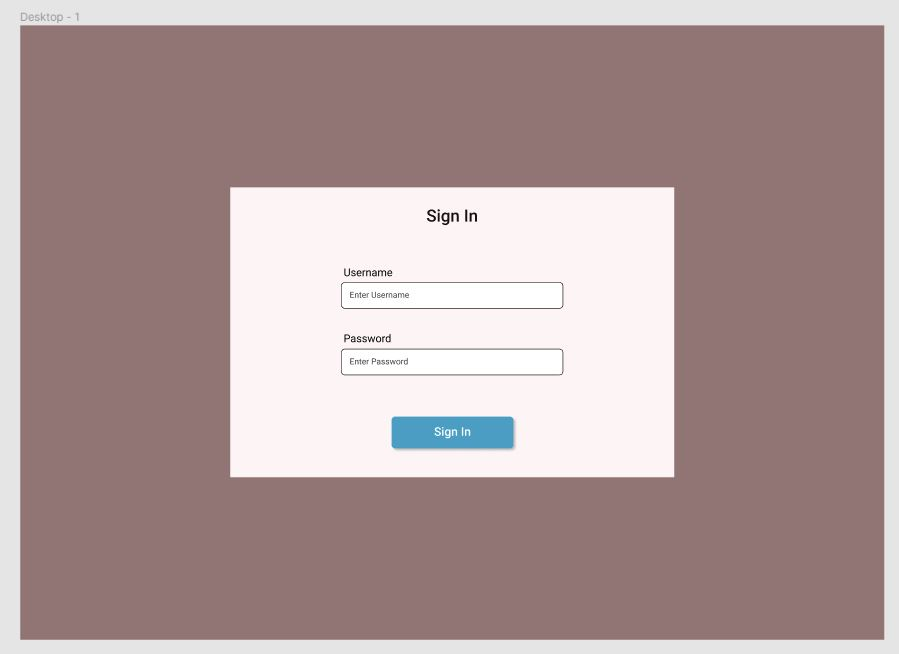

# CSS

[Table of Contents](../readme.md)

Go to: <https://www.w3schools.com/css/default.asp>

Go through the tutorial, advanced, responsive, and grid sections.  As you read through, recreate the examples on your own in Visual Studio Code.

Mini Assignments

* Box Model Display: Use CSS to visually demonstrate each part of the box model.

* Update your login form page.  
  * Let's style your login form in two different ways.
  * For the first, come up with your own idea of how you may want to style the form and go through with it.
  * For the second, use this quick mockup I made in a tool called Figma: 
  * Notice for the one I made: the entire page has a color(the normal full white is blinding), there is elevation on the sign in form section using drop shadow, and the sign in form section also isn't the default white but a very soft mix of the white and the main background color. The sign in header is a larger font than the form labels, which are larger than the form input hints. The inputs and the button have rounded corners, and the button has elevation using drop shadow.  The text is dark on light backgrounds and the text is light on dark backgrounds.  The mockup doesn't look great, I just did it quickly to show off some common design concepts and guidelines.  Take note that the elevation on the button makes it look like something you can interact with.  Take note that the contrast between text color and background color makes the page more accessible.  Take note how font size is used to differentiate between what the text represents i.e a header vs a label.

* Biography page: Choose someone famous and create a simple biography page for them.
  * Include their name and years of life
  * Include an image of them
  * Include a list of achievements with dates
  * Include a section with references
  * Use CSS to make the page and all these sections look nice and presentable.  

* Recipe Display: Find a recipe you like and make a webpage to show off the recipe
  * Have the name and at least one image
  * Show the ingredients and the instructions
  * Use CSS to make things look nice.

* Paint color display project. Web pages need to be responsive and one tool for this is flexbox.  For this project, create a page that has a list of color options for paints.  Each option should be a box that has: a box filled in with the color, the name of the color, and the price.  The product boxes should be displayed using flexbox so that if you make the browser bigger or smaller, the content shrinks and grows and the number of products per row shrinks and grows.  

* Media query project. Create a webpage with two columns, the left one being a navigation menu and the second being content.  Add breakpoints so that at a certain size, the layout changes so that the navigation is on top and the content is on bottom in a way that looks like a single column and fits better for a mobile sized screen.
